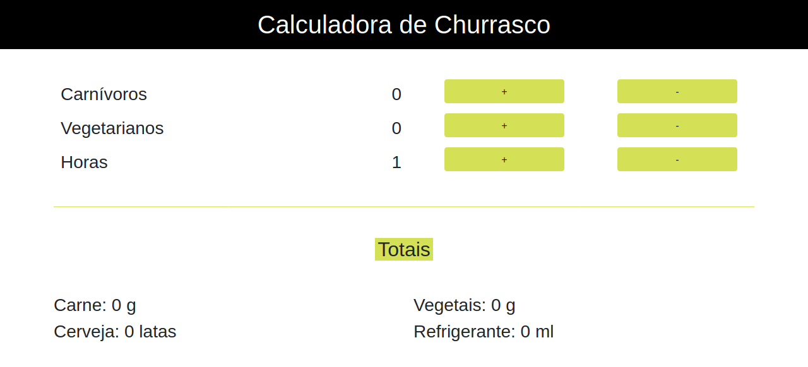

# Calculadora de Churrasco
> Treinamento de Bootstrap

## Descrição da Atividade
Crie uma aplicação responsiva que calcule, a partir do número de pessoas e horas,
os insumos necessários para a realização de um churrasco (litros de cerveja,
refrigerante e quilos de carne/vegetais).

### Do que precisa?
- Seu editor de códigos favorito;
- Criar um template bootstrap;
- A lógica;
- 50g de carne e 50g de vegetais por carnívoro/h;
- 100g de vegetais por vegetariano/h;
- 1 lata de cerveja por pessoa/h;
- 100ml de refrigerante por pessoa/h;

### Observações
- Considerar vegetarianos na conta
- Horário de desenvolvimento: 14:30 - 16:55
    - Intervalo: 16:00 - 16:20

## Resultado
https://djeni98.github.io/calc-churrasco/

